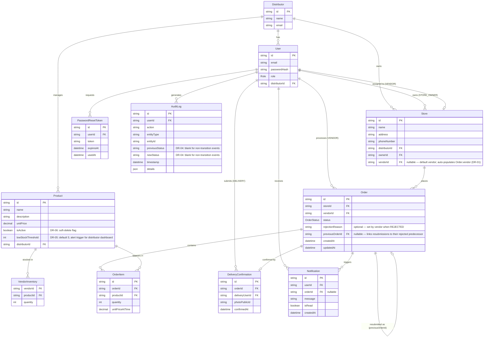
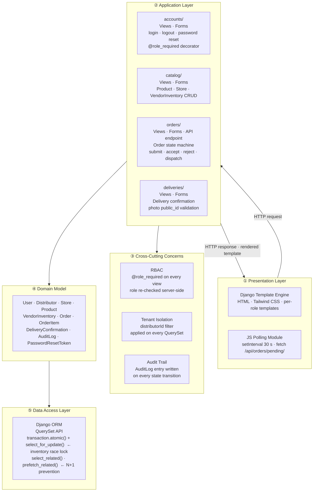
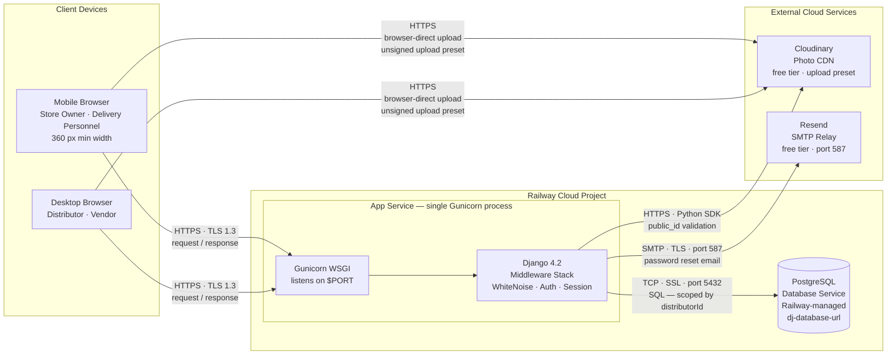
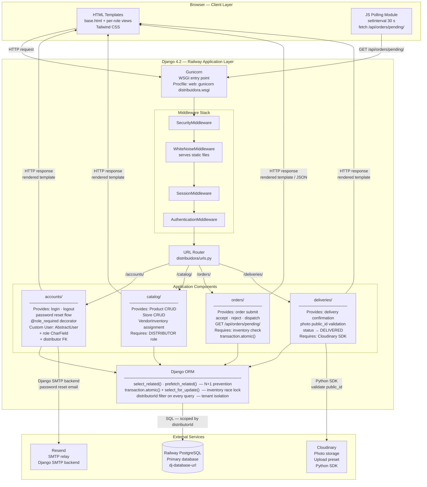
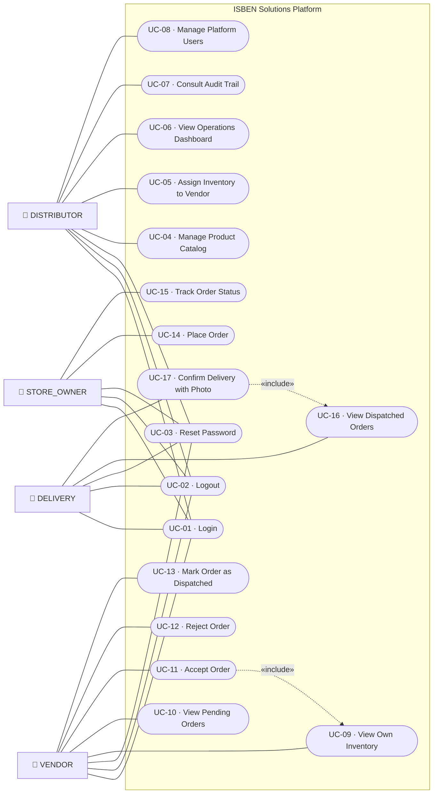

# Requirements — ISBEN Solutions Distribution Platform

**Project:** proyecto-distribuidora  
**Client:** ISBEN Solutions, Loja, Ecuador  
**Team:** 2 students, 1 semester (~3 months build time)  
**Status:** In progress — generic CRUD scaffolding built for all 5 apps; auth/RBAC/tenant isolation/order-lifecycle business logic not yet implemented (see Implementation Status below)  
**Last updated:** 2026-07-15

---

## Implementation Status & Known Issues

This section tracks divergence between this document and the actual state of `proyectoDistribuidora/` — read it before treating any Sprint 1-6 backlog item below as done. Last verified: 2026-07-15, against commit `d3795a6`.

### Currently broken — environment does not run

`manage.py check` fails with `ModuleNotFoundError: No module named 'rest_framework'` on the current dev machine. Commit `d3795a6` added `rest_framework` / `rest_framework.authtoken` to `INSTALLED_APPS` and imports DRF in `catalog/api_views.py` and the root `urls.py`, but the project's `.venv` never had `djangorestframework` installed.

Separately, `requirements.txt` (repo root) pins `Django==5.2.2`, while the `.venv` actually has `Django==6.0.6` installed and running. This is not just drift to reconcile — **it's a hard Python-version constraint**: the team's dev machine runs **Python 3.14.6**, and Django did not support Python 3.14 until the **6.0** release; Django 5.2 (and the 4.2 line referenced further down in Technical Constraints) do not support Python 3.14 at all. So `requirements.txt` must specify `Django>=6.0`, not `5.2.2` or `4.2`, independent of whatever happens to already be installed locally.

`psycopg2-binary==2.9.9` was also newly added to `requirements.txt` in the same commit — its Python 3.14 wheel availability has not been verified yet and should be checked before relying on it; a newer `psycopg2-binary` release may be required.

None of the above has been fixed yet — this is a documentation pass only. The next pass that touches code must resolve this before anything else can be verified.

### Template shadowing bug

Commit `d3795a6` added `catalog/templates/base.html` (includes a login/logout session bar and a ``-linked stylesheet) but it is currently **dead code**: Django's template loader checks `TEMPLATES[0]['DIRS']` (`proyectoDistribuidora/templates/`) before app directories, and the older, plain `proyectoDistribuidora/templates/base.html` (no auth awareness, no stylesheet) lives in `DIRS` and wins every render. The two `base.html` files need to be consolidated into the one in `DIRS` — not done yet.

### Undocumented API surface — DRF catalog API

Commit `d3795a6` added a full CRUD REST API for the catalog app that is **not** part of the originally designed architecture (the Component Diagram / Component Interface Summary above only ever specified one JSON endpoint: `GET /api/orders/pending/`, for the vendor's 30-second dashboard poll). This is being kept as an intentional expansion of scope, so it needs to be treated as a first-class part of the design going forward:

| Endpoint | Method(s) | Auth | Notes |
|----------|-----------|------|-------|
| `/api/stores/` | GET/POST/PUT/PATCH/DELETE | Token or session | `StoreViewSet`, full CRUD |
| `/api/products/` | GET/POST/PUT/PATCH/DELETE | Token or session | `ProductViewSet`, full CRUD |
| `/api/inventory/` | GET/POST/PUT/PATCH/DELETE | Token or session | `VendorInventoryViewSet`, full CRUD |
| `/api/token-auth/` | POST | — | DRF `obtain_auth_token`, issues a token for the above |

**Not yet safe to use in production:** none of these viewsets scope by tenant or restrict by role — any authenticated user of any role, from any distributor, can currently read and write any other distributor's stores/products/inventory through this API. This must be closed (tenant-scoped `get_queryset` + a DISTRIBUTOR-only permission class) before this API surface is exposed beyond local dev. Tracked against FR-02.5 / NFR-01.4 (tenant isolation must be architecturally impossible to bypass — it currently isn't, via this path).

### RBAC / tenant isolation gap (FR-02.3–FR-02.5, NFR-01.2–NFR-01.4) — RESOLVED 2026-07-16

Closed in the Sprint 1 pass (see DR-08 above for the follow-on account-provisioning work): `role_required`/`superuser_required` decorators (`accounts/decorators.py`) applied across every app; every queryset scoped by `distributor` (directly or transitively); password reset implemented (`solicitar_reset_password`/`confirmar_reset_password`); the catalog DRF API tenant/role-scoped (`IsDistributor` permission + scoped `get_queryset`). Verified via `manage.py check` and a test-client smoke test. Login/logout (Django's built-in views) were already working.

### Order integrity gap (FR-05.4, FR-06.2–FR-06.5, FR-09.1–FR-09.2) — RESOLVED 2026-07-16

Closed in the Sprint 3 pass:
- `OrderForm` now only exposes `store` (status/`previous_order`/`rejection_reason` are never client-editable). `editar_pedido`/`eliminar_pedido` (the generic edit that let status be set directly) are removed entirely, replaced by dedicated `aceptar_pedido`/`rechazar_pedido`/`despachar_pedido`/`cancelar_pedido` views (`orders/views.py`) — each gated to the correct role and current status.
- `aceptar_pedido` wraps the stock check + deduction + status transition in a single `transaction.atomic()` block with `select_for_update()` on the affected `StockLevel` rows, scoped by `(product, warehouse)` (DR-01, NFR-03.1, NFR-03.3) — insufficient stock rolls back with a per-item error message and the order stays `PENDING` (NFR-03.2); nothing is written until every item clears the check. **Tier 4.5 (2026-07-21):** this used to lock `VendorInventory` rows per-vendor; stock is now centralized per-warehouse, not per-vendor (confirmed with the business), which is also why FR-05.3 changed — see below.
- `OrderItemForm` no longer accepts `unit_price_at_time` from the client — `orders/views.py` snapshots it server-side from `Product.unit_price` on both create and edit. **Tier 4.5 (2026-07-21):** the `product` field is scoped to `Product.objects.filter(distributor=<order's vendor's distributor>, status=ProductStatus.ACTIVE)` — any active product in the distributor's catalog is orderable regardless of vendor assignment. This replaces the old `Product.objects.filter(inventory__vendor=<order's vendor>, is_active=True)` scoping, which assumed each vendor personally carried a subset of the catalog (route/van-sales style); stock is centralized now, so that assumption no longer holds.
- `GET /api/orders/pending/` (root `urls.py`, `orders.views.pending_orders_api`) added as its own endpoint, distinct from the catalog DRF API — vendor-scoped, `role_required('VENDOR')`. The vendor order list (`orders/templates/orders/index.html`) polls it every 30s via plain JS and prepends newly-arrived `PENDING` orders without a page reload (FR-06.6, FR-10.1, US-10).
- `AuditLog` writes on the original accept/reject/dispatch/cancel transitions are now also in place (backfilled 2026-07-19 — see the Tier 3 section below); this line previously said they were still missing. In-app notifications on `aceptar_pedido`/`rechazar_pedido`/`despachar_pedido` are now also in place (Tier 4, see below) — `cancelar_pedido` doesn't notify anyone, since it's the store owner's own action and no FR-10 sub-item requires it. Resubmitting a rejected order (US-22) is still open — `previous_order` linking exists on the model but nothing sets it yet.
- **Cloudinary `photo_public_id` validation (FR-07.3/NFR-01.5) — SUPERSEDED 2026-07-18, see DR-09.** Photo-based proof-of-delivery was dropped from scope entirely, not just the Cloudinary SDK piece — replaced by a store-owner-confirms-receipt flow. `photo_public_id` is now an optional, unvalidated field with no security role.

### Tier 3 gap (FR-08.1, FR-08.3, FR-09.1–FR-09.3, NFR-02.5, NFR-02.6) — RESOLVED 2026-07-19

- `AuditLog` writes backfilled onto the original `aceptar_pedido`/`rechazar_pedido`/`despachar_pedido`/`cancelar_pedido` views and onto `deliveries.crear_confirmacion`'s `DISPATCHED → DELIVERED` transition — every order status transition now has an audit trail, not just the DR-09 ones. `aceptar_pedido`'s entry also captures the per-item inventory deduction (FR-09.2) inside its `details`, and a failed accept (insufficient stock) now writes its own `order_accept_failed` entry (FR-09.3).
- New distributor operations dashboard: `accounts/dashboard.html` (`/accounts/dashboard/`, `role_required('DISTRIBUTOR')`) — orders grouped by status, the 20 most recent orders, and inventory per product per vendor with a low-stock row highlight (FR-08.1, FR-08.3). Linked from the nav for `DISTRIBUTOR` users. Extended in the Tier 4 pass below with filters and summary metrics.
- `select_related`/`prefetch_related` + `Order` indexes (NFR-02.5, NFR-02.6): `Order` gained a composite index on `(vendor, status)` and one on `store`. Fixed N+1 query patterns across every list view that joins related data: `orders/index.html` and `ver_pedido.html` (store/vendor), `pending_orders_api` (item count was doing one `COUNT` query per order — now a single `annotate`), `catalog/index.html` (store's distributor/owner/vendor, product's distributor, inventory's vendor/product), `deliveries/index.html` (order/delivery_user), `audit/index.html` (acting user).

### Tier 4 gap (FR-04.5, FR-08.2, FR-08.4, FR-10.2–FR-10.4, US-16, US-21) — RESOLVED 2026-07-19

- Notification writes on `aceptar_pedido`/`rechazar_pedido`/`despachar_pedido` (FR-10.2, FR-10.3) — the last three order transitions that didn't notify the store owner. `deliveries.crear_confirmacion` (`DELIVERED`) and the DR-09 transitions already did.
- Unread notification count on every page load (US-16): a new context processor (`accounts/context_processors.py:notifications`, registered in `settings.py`) adds `unread_notification_count` to every template context for any authenticated user — not gated to `STORE_OWNER`, since `VENDOR` and `DELIVERY` also receive notifications via DR-09. Shown in the nav in `base.html`.
- Notifications list + mark-as-read/mark-all-read (US-16): `accounts/notificaciones.html` (`/accounts/notifications/`) plus the two POST-only actions, all `role_required` to any of the four roles (`Role.values`).
- Dashboard filters (FR-08.2): date range, vendor, store, status — GET params on `/accounts/dashboard/`, applied to both the order list and the summary metrics below.
- Summary metrics (FR-08.4): total orders, fulfilled (`CONFIRMED`), rejected, and average fulfillment time (computed from `updated_at - created_at` for `CONFIRMED` orders — `updated_at` reliably reflects the moment an order reached `CONFIRMED` regardless of whether it went through the direct confirm-receipt path or the report-issue → resolve-issue path, since that final status-setting save is always the last write). Filterable via the same vendor/date-range filters.
- Low-stock alert badge (FR-04.5, US-21): a summary banner ("⚠ N producto(s) con stock bajo") at the top of the dashboard, in addition to the existing per-row highlight and ⚠ marker in the inventory table (the latter already existed in `catalog/index.html`; the dashboard's inventory table didn't have the ⚠ text marker before this pass, only the CSS highlight — now has both, matching `catalog/index.html`).

### Repo hygiene (flagged, not evaluated further here)

Commit `d3795a6` also added a 112KB `proyectoDistribuidora.zip` at the repo root — very likely an accidental commit (e.g., a local backup archive), not a real project artifact. Worth removing, but that's a version-control decision for the team, not addressed in this document.

---

## MoSCoW Key

| Label | Meaning |
|-------|---------|
| **M** | Must have — MVP cannot ship without this |
| **S** | Should have — important but not a blocker |
| **C** | Could have — desirable if time permits |
| **W** | Won't have — explicitly deferred to post-MVP roadmap |

---

## Entity Model

### Entities & Cardinalities

```
Distributor  ||--o{ User           : "has many"
Distributor  ||--o{ Store          : "owns"
Distributor  ||--o{ Product        : "manages catalog"
User         ||--o{ Store          : "STORE_OWNER owns"
User         ||--o{ VendorInventory: "VENDOR holds"
Store        ||--o{ Order          : "places"
User         ||--o{ Order          : "VENDOR processes"
Order        ||--o{ OrderItem      : "contains"
Product      ||--o{ OrderItem      : "referenced by"
Product      ||--o{ VendorInventory: "stocked in"
Order        ||--o| DeliveryConfirmation : "confirmed by"
User         ||--o{ DeliveryConfirmation : "DELIVERY submits"
User         ||--o{ AuditLog       : "generates"
User         ||--o{ PasswordResetToken : "requests"
```

### ER Diagram (Mermaid)



### Order Status State Machine

```
PENDING → ACCEPTED → DISPATCHED → DELIVERED → CONFIRMED
                                            → DELIVERY_ISSUE → CONFIRMED
PENDING → REJECTED → (new Order with previousOrderId pointing back)
```

Per DR-09: `DELIVERED` is non-terminal — it means the delivery person dropped
the order off, awaiting the store owner's confirmation. The store owner then
moves it to `CONFIRMED` (received as expected) or `DELIVERY_ISSUE` (a
dispute); resolving an issue moves it back to `CONFIRMED`.

---

## Design Decisions (Gap Resolutions)

Resolved before prototype design. Each decision closes a gap identified in the BA review.

### DR-01 — Vendor-to-Store Assignment

**Gap:** No mechanism assigned a vendor to an order at creation time (`Order.vendor` was non-nullable but unpopulated).

**Decision:** Each `Store` has a nullable `vendor FK`. The distributor sets this when creating or editing a store. When a store owner places an order, `Order.vendor` is auto-populated from `store.vendor`; no vendor selection step exists in the order flow.

**Edge case:** If a store has no vendor assigned, the Place Order action is blocked and the store owner sees: *"Tu tienda no tiene un vendedor asignado. Contacta al distribuidor."*

---

### DR-02 — Delivery Order Visibility

**Gap:** No per-delivery-person assignment mechanism existed; "assigned to their route" was undefined.

**Decision:** For MVP, all `DELIVERY` users within the same distributor see all `DISPATCHED` orders. They self-select on a first-come, first-served basis. `DeliveryConfirmation.delivery_user` records who confirmed. Route/zone assignment is post-MVP (see Out of Scope).

---

### DR-03 — In-App Notifications

**Gap:** `STORE_OWNER` notifications (US-12, US-13, US-16) had no model or delivery mechanism.

**Decision:** A `Notification` model is added (fields: `user FK`, `order FK nullable`, `message`, `is_read`, `created_at`). Notifications are written server-side on every order status transition. Store owners see their unread count on page load — no real-time polling for store owners in MVP. Vendor 30-second polling is unchanged.

---

### DR-04 — AuditLog Typed Status Fields

**Gap:** `AuditLog` stored everything in `details JSONField`; FR-09.1 requires queryable `previous_status` / `new_status`.

**Decision:** Two `CharField` columns (`previous_status`, `new_status`) are added to `AuditLog`. They are blank for non-transition events (e.g., catalog changes). The `details` field is retained for additional context (quantities, before/after values).

---

### DR-05 — Low-Stock Threshold

**Gap:** US-21 required a configurable threshold per product; no field or UI story existed for it.

**Decision:** `low_stock_threshold` (PositiveIntegerField, default 5) is added to `Product`. The distributor configures it from the product edit form (US-25). The distributor dashboard alerts when any `VendorInventory.quantity < product.low_stock_threshold`.

---

### DR-06 — Product Soft-Delete

**Gap:** US-06 required deactivation; `eliminar_producto` performed a hard delete that would cascade to `OrderItem`.

**Decision:** `Product` gains `is_active BooleanField (default=True)`. The delete action now sets `is_active=False`; hard deletes are blocked at the application layer. Deactivated products can be reactivated (new `reactivar_producto` view). A deactivated product's `VendorInventory` rows are preserved but hidden from the order placement form. Vendors may still accept pending orders referencing a deactivated product because the stock check uses the `VendorInventory` record, not the `is_active` flag.

---

### DR-07 — Per-Role User Creation Pages

**Gap:** US-24 originally specified a single "create user" form with a `role` dropdown (VENDOR / STORE_OWNER / DELIVERY / DISTRIBUTOR); in practice this made it easy for a distributor admin to pick the wrong role by mistake, and gave every account type an identical, unlabeled creation page.

**Decision:** `role` is removed from `UserCreateForm` and is instead fixed by the URL: `accounts/users/new/<role>/` (`crear_usuario` view, `accounts/urls.py`). The `accounts` index page now links to four separate pages — "+ Admin Distribuidor", "+ Vendedor", "+ Dueño de Tienda", "+ Repartidor" — each rendering the same template with a role-specific heading and no role field to choose. An unknown `role` segment 404s. `UserEditForm` is unchanged and still exposes `role` as an editable dropdown, since reassigning an existing user's role is a distinct action from creating one.

---

### DR-08 — Account Provisioning: Distributor Onboarding and Store Owner Self-Registration

**Gap:** FR-01.1 ("register with email, password, and a pre-assigned role") and UC-01's precondition ("user has a registered account with an assigned role") assumed every account is provisioned by an admin ahead of time — there is no self-registration user story anywhere in this document. In practice this created two problems: (1) creating a new `Distributor` tenant was a two-step, superuser-only flow — create the `Distributor` record in-app, then separately use `/admin/` to create its first `DISTRIBUTOR`-role user, since `crear_usuario` itself requires an existing `DISTRIBUTOR` user to be logged in; (2) every `STORE_OWNER` account had to be created manually by a distributor admin, which doesn't scale for a distributor with many small, non-technical retail customers and puts unnecessary friction on the least technical role in the system.

**Decision:**
- **Distributor onboarding stays superuser-gated** (this deployment serves one real client, ISBEN Solutions — multi-tenancy exists for data isolation correctness, not for public multi-tenant self-signup), but is now a single combined step. `crear_distribuidor` (`accounts/views.py`) uses `DistributorOnboardingForm` to create the `Distributor` and its first `DISTRIBUTOR`-role `User` together inside one `transaction.atomic()` block — no more dropping into `/admin/` for the second half.
- **Store owners self-register via a per-distributor invite link**, not a public signup form. `Distributor` gained an opaque `invite_token` field (`accounts/models.py`, `secrets.token_urlsafe(32)`, regenerable via `regenerate_invite_token()` if a link/QR code is compromised). The unauthenticated route `accounts/join/<token>/` (`registrar_tienda` view) resolves the token to exactly one `Distributor` and renders a minimal form (`StoreOwnerSignupForm`: email, password, store name/address/phone) — the distributor is implicit in the link, never chosen from a public list, so the existence of other distributors is never exposed and the non-technical store owner never has to correctly identify their own distributor from a menu. On submit, the `STORE_OWNER` `User` and their `Store` are created atomically and the new user is logged in immediately. The new `Store` starts with no `vendor` assigned; the existing DR-01 edge-case message ("Tu tienda no tiene un vendedor asignado...") already covers this until the distributor assigns one.
- The distributor's own dashboard (`accounts/index.html`) displays the full invite URL (meant to be shared via WhatsApp or printed as a QR code) plus a "generar nuevo enlace" action to revoke and rotate it.

**Not done in this pass:** rate-limiting or CAPTCHA on `registrar_tienda` (a guessable-enough token plus no throttling means the endpoint could be hit repeatedly to enumerate valid distributor tokens by trial, though `token_urlsafe(32)` makes brute-forcing infeasible in practice); email verification for self-registered store owners.

---

### DR-09 — Delivery Confirmation Without Cloudinary: Store-Owner Attestation Replaces Photo Proof

**Gap:** FR-07.3/NFR-01.5 required Cloudinary-validated photos as the mechanism proving a delivery actually happened, and `DELIVERED` was a terminal status set unilaterally by the delivery person. Cloudinary was never implemented (`photo_public_id` accepted any string with no validation) — but the deeper problem, raised when descoping Cloudinary, is that photo proof was never the right source of truth for this business: it proves *a* photo was taken, not that the *right* products arrived in the *right* condition. Only the store owner receiving the order can actually verify that.

**Decision:** Photo-based proof-of-delivery is dropped from scope entirely (not just the Cloudinary SDK piece) and replaced with a store-owner-attestation flow:
- `Order.status` gains two states past `DELIVERED`: `CONFIRMED` (store owner verified the order and it's correct) and `DELIVERY_ISSUE` (store owner disputes it). `DELIVERED` becomes non-terminal — see the updated Order Status State Machine above.
- `deliveries.crear_confirmacion` (unchanged trigger: the delivery person marking a `DISPATCHED` order as delivered) now also flips `Order.status` to `DELIVERED` and creates a `Notification` to the store owner — previously this view created a `DeliveryConfirmation` record but never actually touched `Order.status` at all, a pre-existing gap DR-09 also closes. `DeliveryConfirmationForm`'s `order` field is now scoped to `DISPATCHED` orders only (previously any order in the distributor, regardless of status, could be picked).
- `DeliveryConfirmation.photo_public_id` becomes optional (`blank=True`) and is never validated — it's now just metadata the delivery person may optionally leave, not proof of anything. No Cloudinary dependency, no upload preset, no SDK.
- Three new `orders/` views implement the store owner's side: `confirmar_recepcion` (`DELIVERED`→`CONFIRMED`, notifies the vendor, writes an `AuditLog` entry) and `reportar_incidencia` (`DELIVERED`→`DELIVERY_ISSUE`, captures `Order.issue_description`/`issue_reported_at`, notifies both the vendor and the delivery person). The vendor resolves a dispute via `resolver_incidencia` (`DELIVERY_ISSUE`→`CONFIRMED`, captures `Order.resolution_notes`/`resolved_at`, notifies the store owner, writes an `AuditLog` entry) — resolution is notes-only in this pass, no inventory adjustment or partial-fulfillment tooling (see "Not done in this pass" below).
- `AuditLog` writes are scoped to just these two new transitions (`order_confirmed`, `delivery_issue_resolved`) — writing entries for the older `aceptar_pedido`/`rechazar_pedido`/`despachar_pedido` transitions remains the separate, already-tracked Tier 3 gap (see Implementation Status above).

**Explicitly out of scope (see "Out of Scope (MVP)" below):** Cloudinary SDK integration, unsigned upload presets, and server-side `public_id` validation are dropped from the MVP, not deferred to a later sprint — FR-07.3/NFR-01.5 as originally written are superseded by this DR, not merely unimplemented. Structured remediation on a resolved issue (inventory adjustment, partial fulfillment, redelivery tracking) is deferred, not built — `resolver_incidencia` only records notes and flips status.

---

### DR-10 — Distributor Self-Service Invitations

**Gap:** DR-08 fixed the two-step distributor-onboarding flow into one atomic step, but it was still exclusively superuser-driven — a new `Distributor` tenant could only be created by a superuser using `crear_distribuidor`, one at a time. Part of the ISBEN roadmap's item 3 ("distributor invitation links") asked for the same self-service pattern DR-08 already gave store owners, extended one level up.

**Decision:**
- **`DistributorInvitation`** (`accounts/models.py`) is a single-use, expiring token — `token` (matches `PasswordResetToken.token`'s shape, not `Distributor.invite_token`'s, since a *new* `Distributor` doesn't exist yet at invite time to hang a token off of), `target_email` (optional — the prospective admin's login email, not the distributor's company email; blank means link-only), `expires_at` (fixed at 7 days from issuance), `used_at`, `revoked_at`, and `created_by` (`on_delete=SET_NULL`, matching `AuditLog.user`'s convention).
- **Issuance stays superuser-gated** (`emitir_invitacion`), same rationale as DR-08's distributor onboarding — `Distributor` is the top of the tenant hierarchy, so there's no higher-level tenant to scope this action to. If `target_email` is set, the link is emailed automatically; if the send fails, or no `target_email` was given, the superuser sees the raw link in the UI to share manually. The invitations list (`invitaciones`) is both the audit view (pending/expired/used/revoked) and that manual-link fallback, and superusers reach it via a cross-link on `crear_distribuidor.html` (the one existing superuser-reachable page — `accounts/index.html` is `@role_required('DISTRIBUTOR')` and unreachable by a superuser, whose `role` field is blank).
- **Redemption** (`registrar_distribuidor`, unauthenticated, reached via the invitation link) reuses `DistributorOnboardingForm`'s field-population logic directly to create the `Distributor` and its first `DISTRIBUTOR` user — but nested inside the SAME `transaction.atomic()` + `select_for_update()` block that locks the `DistributorInvitation` row and writes `used_at`, mirroring `aceptar_pedido`'s single-atomic-block lock pattern (Tier 2/4.5). Splitting entity creation into a second transaction (e.g. by calling `crear_distribuidor` itself, which opens its own independent atomic block) would silently defeat the lock. Expired/used/revoked tokens each render a distinct message, mirroring `confirmar_reset_password`'s `motivo` pattern. A `target_email` set on the invitation must match the redeeming admin's email case-insensitively.
- **Revoke** (one action on the invitations list) lets a superuser invalidate a pending invitation — a typo'd `target_email` or a changed mind doesn't have to sit until the 7-day expiry.
- `AuditLog` entries are written on issue, redeem, and revoke — actor is the issuing/revoking superuser on issue/revoke, and the newly-created user on redeem (matching this codebase's "actor of this specific transition" convention, e.g. the vendor who accepts an order rather than the store owner who placed it).

**Not done in this pass:** rate-limiting on `registrar_distribuidor` and a superuser-configurable expiry window at issuance — both would defend against a public-internet threat model or a scale this project, being local-only with no deployment target, doesn't have yet (same posture DR-08 already took on `registrar_tienda`'s equivalent gap). CAPTCHA is infeasible without a real deployment (it needs a registered public domain). A shared token/expiry base class across `Distributor.invite_token`, `PasswordResetToken`, and `DistributorInvitation` — now duplicated three ways — is deferred until the pattern proves itself a fourth time.

---

## System Architecture

### Logical Architecture

The logical architecture describes **what** the system does and how responsibilities are organized across layers — independent of any deployment or infrastructure choice. The system follows Django's MVT (Model-View-Template) pattern mapped onto five layers:

| # | Layer | Responsibility |
|---|-------|----------------|
| ① | Presentation | Renders HTML responses and runs the client-side polling loop |
| ② | Application | Receives HTTP requests, enforces RBAC, executes business rules |
| ③ | Cross-Cutting | RBAC guard, tenant isolation, and audit trail — applied across all apps |
| ④ | Domain Model | The entities and their relationships (see ER Diagram) |
| ⑤ | Data Access | Translates ORM calls into SQL; owns transactional integrity |



---

### Physical Architecture

The physical architecture describes **where** the system runs — which processes exist, on what infrastructure, and how they communicate over the network.



#### Physical nodes

| Node | Type | Hosts | Notes |
|------|------|-------|-------|
| **Client Browser** | User device | HTML templates, JS polling | Mobile or desktop; no native app |
| **Railway App Service** | Managed PaaS container | Gunicorn + Django + WhiteNoise | Single process; scales vertically on Railway free tier |
| **Railway PostgreSQL** | Managed DB service | All relational data | Same Railway project; connected via `DATABASE_URL` |
| **Cloudinary** | External CDN/storage | Delivery confirmation photos | Browser uploads directly; Django validates `public_id` server-side |
| **Resend** | External SMTP relay | Password reset emails | Django SMTP backend points to `smtp.resend.com:587` |

#### Network flows

| Flow | Protocol | Direction | Trigger |
|------|----------|-----------|---------|
| Page request / response | HTTPS | Browser → Railway → Browser | Any user action |
| Order polling | HTTPS (JSON) | Browser → Railway | Every 30 s on vendor dashboard |
| Database queries | TCP/SSL · PostgreSQL wire | Django → Railway PostgreSQL | Every view that reads/writes data |
| Photo upload | HTTPS (multipart) | Browser → Cloudinary | Delivery confirmation form |
| Photo validation | HTTPS (Python SDK) | Django → Cloudinary | After delivery confirmation submit |
| Password reset email | SMTP · TLS | Django → Resend | Password reset request |

---

## Component Diagram

### Layers

The system is structured in four horizontal layers. Each layer communicates only with the layer directly adjacent to it; no layer skips over another.

| Layer | Responsibility |
|-------|----------------|
| **Client** | Renders HTML responses and runs the JS polling loop |
| **Application** | Handles HTTP, enforces RBAC, executes business logic |
| **Data Access** | Translates ORM calls into SQL; guarantees transactional integrity |
| **External Services** | PostgreSQL, Cloudinary, Resend — managed outside the app |

---

### Diagram



---

### Component Interface Summary

| Component | Provided Interface | Required Interface |
|-----------|-------------------|--------------------|
| **accounts/** | `POST /accounts/login/` · `POST /accounts/logout/` · `POST /accounts/password-reset/` · `@role_required` decorator | Django ORM · Resend SMTP |
| **catalog/** | `GET/POST/PUT/DELETE /catalog/products/` · `GET/POST/PUT /catalog/stores/` · `POST /catalog/inventory/` | Django ORM · `DISTRIBUTOR` role check |
| **orders/** | `POST /orders/` (submit) · `POST /orders/<id>/accept/` · `POST /orders/<id>/reject/` · `POST /orders/<id>/dispatch/` · `GET /api/orders/pending/` | Django ORM · `transaction.atomic()` · `select_for_update()` |
| **deliveries/** | `POST /deliveries/<id>/confirm/` | Django ORM · Cloudinary Python SDK |
| **Django ORM** | `QuerySet` API · `transaction.atomic()` · `select_for_update()` · `select_related()` | Railway PostgreSQL via `dj-database-url` |
| **Gunicorn** | WSGI HTTP server on `0.0.0.0:$PORT` | Django WSGI app (`distribuidora.wsgi`) |
| **WhiteNoise** | Serves `/static/**` directly from process memory | Collected static files (`collectstatic`) |
| **Cloudinary** | Photo upload + CDN delivery | Upload preset (restricts client-direct uploads) |
| **Resend** | SMTP relay on port 465/587 | — |
| **Railway PostgreSQL** | PostgreSQL wire protocol | — |

---

### Key Cross-Cutting Concerns

- **Tenant isolation:** Every ORM query in `accounts/`, `catalog/`, `orders/`, and `deliveries/` applies a `distributorId` filter. This is enforced at the ORM layer, not only at the view layer.
- **Concurrency safety:** The `orders/` component wraps inventory check + deduction + status update in a single `transaction.atomic()` block with `select_for_update()` on the affected `VendorInventory` row. This prevents double-acceptance when two vendors act simultaneously.
- **Static files:** WhiteNoise serves static assets directly from the Gunicorn process — no separate CDN or nginx is required on Railway free tier.
- **Photo fraud prevention:** The `deliveries/` component validates that each submitted `public_id` was generated by the app's own Cloudinary upload preset before persisting the confirmation.

---

## Use Cases

### Use Case Diagram



**Relationship notes:**
- `UC-11 «include» UC-09` — accepting an order requires the system to verify the vendor's current inventory level before committing.
- `UC-17 «include» UC-16` — a delivery person must view the dispatched order before they can confirm it.

---

### Use Case Specifications

#### UC-01 — Login

| Attribute | Detail |
|-----------|--------|
| **Actors** | DISTRIBUTOR, VENDOR, STORE_OWNER, DELIVERY |
| **Preconditions** | User has a registered account with an assigned role |
| **Main Flow** | 1. User navigates to `/accounts/login/` · 2. User enters email and password · 3. System validates credentials · 4. System creates a server-side session · 5. System redirects to the user's role dashboard |
| **Alt Flow A1** | Wrong password → generic error message; session not created; no user enumeration |
| **Alt Flow A2** | Account not found → same generic error as A1 (prevents enumeration) |
| **Postconditions** | Authenticated session exists; user is on their role dashboard |
| **Related FR** | FR-01.1, FR-01.2 |

---

#### UC-03 — Reset Password

| Attribute | Detail |
|-----------|--------|
| **Actors** | DISTRIBUTOR, VENDOR, STORE_OWNER, DELIVERY |
| **Preconditions** | User has a registered email address |
| **Main Flow** | 1. User requests password reset with their email · 2. System generates a single-use token with 1 h expiry · 3. System sends reset link via Resend SMTP · 4. User clicks the link · 5. System validates the token (not used, not expired) · 6. User sets a new password · 7. Token is marked as used |
| **Alt Flow A1** | Token already used → error: "este enlace ya fue utilizado" |
| **Alt Flow A2** | Token expired → error: "el enlace ha expirado, solicita uno nuevo" |
| **Alt Flow A3** | Email not found → silent success response (prevents enumeration) |
| **Postconditions** | Password updated; old token invalidated; user can log in with new password |
| **Related FR** | FR-01.3, FR-01.4, FR-01.6 |

---

#### UC-04 — Manage Product Catalog

| Attribute | Detail |
|-----------|--------|
| **Actors** | DISTRIBUTOR |
| **Preconditions** | User is authenticated as DISTRIBUTOR |
| **Main Flow** | 1. Distributor navigates to `/catalog/products/` · 2. Distributor creates a product (name, description, unit price, initial stock) · 3. System saves the product scoped to `distributor.id` · 4. Product appears in the catalog list |
| **Alt Flow A1** | Edit → distributor selects a product, updates fields, system saves new values (does not affect existing `unitPriceAtTime` in past orders) |
| **Alt Flow A2** | Deactivate → product hidden from vendor inventory assignment; existing orders unaffected |
| **Alt Flow A3** | Missing required field → form validation error; product not saved |
| **Postconditions** | Product exists in the catalog and is available for inventory assignment |
| **Related FR** | FR-03.1–FR-03.4 |

---

#### UC-05 — Assign Inventory to Vendor

| Attribute | Detail |
|-----------|--------|
| **Actors** | DISTRIBUTOR |
| **Preconditions** | Product exists in catalog; target user has VENDOR role and belongs to the same distributor |
| **Main Flow** | 1. Distributor selects a vendor and a product · 2. Distributor enters quantity to assign · 3. System creates or updates the `VendorInventory` record · 4. Vendor's inventory is updated immediately |
| **Alt Flow A1** | Quantity = 0 → treated as removing the product from the vendor's inventory |
| **Alt Flow A2** | Negative quantity → validation error |
| **Postconditions** | `VendorInventory` record reflects the new quantity; distributor dashboard shows updated levels |
| **Related FR** | FR-03.5, FR-04.1 |

---

#### UC-11 — Accept Order

| Attribute | Detail |
|-----------|--------|
| **Actors** | VENDOR |
| **Preconditions** | Order exists in `PENDING` status; order is assigned to this vendor |
| **Main Flow** | 1. Vendor views the pending order · 2. Vendor clicks "Aceptar" · 3. System opens a database transaction (`transaction.atomic()`) · 4. System locks the `VendorInventory` rows for the ordered products (`select_for_update()`) · 5. System validates available stock ≥ ordered quantity for all items · 6. System deducts inventory for each item · 7. System transitions order to `ACCEPTED` · 8. System writes an AuditLog entry · 9. Transaction commits |
| **Alt Flow A1** | Insufficient stock for any item → transaction rolled back; order remains `PENDING`; vendor sees per-item error message |
| **Alt Flow A2** | Concurrent accept (two vendors click simultaneously) → only the first transaction succeeds; the second receives A1 error |
| **Postconditions** | Order is `ACCEPTED`; inventory deducted; audit entry recorded; store owner notified (in-app) |
| **Related FR** | FR-04.3, FR-04.4, FR-06.2–FR-06.4, FR-09.1–FR-09.2 |

---

#### UC-12 — Reject Order

| Attribute | Detail |
|-----------|--------|
| **Actors** | VENDOR |
| **Preconditions** | Order exists in `PENDING` status; order is assigned to this vendor |
| **Main Flow** | 1. Vendor views the pending order · 2. Vendor clicks "Rechazar" · 3. System prompts for confirmation · 4. Vendor confirms · 5. System transitions order to `REJECTED` · 6. System writes an AuditLog entry |
| **Alt Flow A1** | Vendor cancels the confirmation prompt → order remains `PENDING` |
| **Postconditions** | Order is `REJECTED`; inventory unchanged; store owner notified (in-app); audit entry recorded |
| **Related FR** | FR-06.2, FR-06.4, FR-09.1 |

---

#### UC-13 — Mark Order as Dispatched

| Attribute | Detail |
|-----------|--------|
| **Actors** | VENDOR |
| **Preconditions** | Order is in `ACCEPTED` status; order is assigned to this vendor |
| **Main Flow** | 1. Vendor views the accepted order · 2. Vendor clicks "Marcar como Despachado" · 3. System confirms intent · 4. System transitions order to `DISPATCHED` · 5. System writes an AuditLog entry · 6. Order becomes visible in the delivery queue |
| **Postconditions** | Order is `DISPATCHED`; delivery personnel can now see it; store owner notified (in-app) |
| **Related FR** | FR-06.5, FR-09.1 |

---

#### UC-14 — Place Order

| Attribute | Detail |
|-----------|--------|
| **Actors** | STORE_OWNER |
| **Preconditions** | User is authenticated as STORE_OWNER; at least one vendor has inventory assigned |
| **Main Flow** | 1. Store owner navigates to "Nuevo Pedido" · 2. System shows available products from the assigned vendor · 3. Store owner selects products and quantities · 4. Store owner submits the order · 5. System validates all products exist in the vendor's `VendorInventory` · 6. System captures `unitPriceAtTime` for each item · 7. System creates the order in `PENDING` status · 8. System confirms submission to the store owner |
| **Alt Flow A1** | One or more products not in vendor inventory → order rejected; per-item error shown; no order created |
| **Alt Flow A2** | Quantity = 0 for any item → validation error before submission |
| **Postconditions** | Order exists in `PENDING` status; vendor sees it in their dashboard within 30 s (polling); store owner can track it |
| **Related FR** | FR-05.1, FR-05.3, FR-05.4 |

---

#### UC-17 — Confirm Delivery with Photo

| Attribute | Detail |
|-----------|--------|
| **Actors** | DELIVERY |
| **Preconditions** | Order is in `DISPATCHED` status and assigned to this delivery person |
| **Main Flow** | 1. Delivery person navigates to the dispatched order · 2. Delivery person uploads a photo using the platform's upload widget · 3. Browser uploads the photo directly to Cloudinary via the upload preset · 4. Cloudinary returns a `public_id` · 5. Delivery person submits the confirmation form with the `public_id` · 6. System validates the `public_id` via the Cloudinary Python SDK · 7. System creates a `DeliveryConfirmation` record storing the `public_id` · 8. System transitions order to `DELIVERED` · 9. System writes an AuditLog entry |
| **Alt Flow A1** | `public_id` not generated by the platform's upload preset → confirmation rejected; order remains `DISPATCHED` |
| **Alt Flow A2** | No photo uploaded → form validation error; submission blocked |
| **Postconditions** | Order is `DELIVERED`; photo stored as `public_id`; distributor sees completed order; audit entry recorded |
| **Related FR** | FR-07.1–FR-07.5, FR-09.1 |

---

## User Stories

Stories are grouped by Epic. Each story maps to one or more use cases and functional requirements.

---

### Epic 1 — Authentication

**US-01** — Iniciar sesión  
*As any user, I want to log in with my email and password so that I can access the features of my assigned role.*  
**Priority:** M | **Related:** UC-01, FR-01.1, FR-01.2  
**Acceptance Criteria:**
- [ ] Given valid credentials, the system creates a session and redirects to the role dashboard.
- [ ] Given invalid credentials, a generic error is shown and no session is created.
- [ ] A user with role VENDOR cannot access `/distributor/*` routes after login.

---

**US-02** — Cerrar sesión  
*As any user, I want to log out so that my session is terminated and no one else can use my account.*  
**Priority:** M | **Related:** UC-02, FR-01.5  
**Acceptance Criteria:**
- [ ] Clicking "Cerrar sesión" destroys the server-side session.
- [ ] After logout, navigating to any protected route redirects to the login page.

---

**US-03** — Recuperar contraseña  
*As any user, I want to reset my password by email so that I can regain access if I forget it.*  
**Priority:** M | **Related:** UC-03, FR-01.3, FR-01.4, FR-01.6  
**Acceptance Criteria:**
- [ ] The reset link arrives in the registered email within 2 minutes.
- [ ] The link expires after 1 hour and shows an error if used afterwards.
- [ ] The link can only be used once; a second use shows an error.
- [ ] After reset, the user can log in with the new password.

---

### Epic 2 — Distributor: Product Catalog

**US-24** — Gestionar usuarios de la plataforma  
*As a DISTRIBUTOR, I want to create users and assign them roles so that vendors, store owners, and delivery personnel can access the system.*  
**Priority:** M | **Related:** UC-08, FR-02.1, DR-07  
**Acceptance Criteria:**
- [x] Distributor creates a user via a role-specific page (Admin Distribuidor / Vendedor / Dueño de Tienda / Repartidor) rather than picking a role from a dropdown — see DR-07.
- [ ] Distributor can edit a user's role and active status.
- [ ] A user created by Distributor A is invisible to Distributor B.
- [ ] The distributor cannot create another DISTRIBUTOR-role user.

---

**US-04** — Crear producto  
*As a DISTRIBUTOR, I want to add a new product to the catalog so that vendors can sell it to stores.*  
**Priority:** M | **Related:** UC-04, FR-03.1  
**Acceptance Criteria:**
- [ ] Form requires: name, description, unit price, initial stock quantity.
- [ ] Saved product appears in the catalog list immediately.
- [ ] Product is scoped to the distributor's `id`; other distributors cannot see it.

---

**US-05** — Editar producto  
*As a DISTRIBUTOR, I want to edit a product's price and description so that the catalog stays up to date.*  
**Priority:** M | **Related:** UC-04, FR-03.2  
**Acceptance Criteria:**
- [ ] Price change is reflected immediately in the catalog.
- [ ] All existing orders retain their original `unitPriceAtTime`; historical totals do not change.

---

**US-06** — Desactivar / reactivar producto  
*As a DISTRIBUTOR, I want to deactivate a product so that vendors can no longer place new orders for it, and reactivate it when it becomes available again.*  
**Priority:** S | **Related:** UC-04, FR-03.3, DR-06  
**Acceptance Criteria:**
- [ ] Deactivated product (`is_active=False`) no longer appears in the vendor's available inventory or the order placement form.
- [ ] Orders that already contain the product are unaffected; vendors may still accept pending orders for it.
- [ ] A reactivate action restores `is_active=True`; the product reappears in the vendor inventory view.
- [ ] No product is ever hard-deleted from the database through the UI.

---

**US-07** — Asignar inventario a vendedor  
*As a DISTRIBUTOR, I want to assign a quantity of a product to a specific vendor so that the vendor can fulfil orders for that product.*  
**Priority:** M | **Related:** UC-05, FR-03.5, FR-04.1  
**Acceptance Criteria:**
- [ ] Distributor selects vendor + product + quantity; record is saved immediately.
- [ ] Updated stock level is visible on the operations dashboard.
- [ ] A vendor from a different distributor cannot see this assignment.

---

### Epic 3 — Distributor: Operations

**US-08** — Ver dashboard de operaciones  
*As a DISTRIBUTOR, I want a real-time overview of all orders and current inventory so that I can manage the business without making phone calls.*  
**Priority:** M | **Related:** UC-06, FR-08.1, FR-08.3  
**Acceptance Criteria:**
- [ ] Dashboard shows orders grouped by status (PENDING, ACCEPTED, DISPATCHED, DELIVERED, REJECTED).
- [ ] Dashboard shows stock levels per product per vendor.
- [ ] Data reflects the latest state within one page load.

---

**US-09** — Consultar auditoría de un pedido  
*As a DISTRIBUTOR, I want to see the full history of events for any order so that I can investigate disputes or errors.*  
**Priority:** M | **Related:** UC-07, FR-09.1, FR-09.5  
**Acceptance Criteria:**
- [ ] Audit log for an order shows: timestamp, actor (user name + role), action, previous status, new status.
- [ ] Accessible from the order detail view.
- [ ] Entries are in chronological order and cannot be deleted.

---

### Epic 4 — Vendor: Order Processing

**US-10** — Ver pedidos pendientes  
*As a VENDOR, I want my dashboard to show new pending orders automatically so that I don't miss any without refreshing the page.*  
**Priority:** M | **Related:** UC-10, FR-06.1, FR-06.6, FR-10.1  
**Acceptance Criteria:**
- [ ] Dashboard fetches `/api/orders/pending/` every 30 seconds.
- [ ] New orders appear within 30 seconds of being placed without manual refresh.
- [ ] Only orders assigned to this vendor are shown.

---

**US-11** — Aceptar pedido  
*As a VENDOR, I want to accept a pending order so that inventory is reserved and the store knows their order is being prepared.*  
**Priority:** M | **Related:** UC-11, FR-04.3, FR-06.2–FR-06.4  
**Acceptance Criteria:**
- [ ] On accept, inventory is deducted atomically; no race condition with a concurrent accept.
- [ ] If stock is insufficient, the order stays PENDING and the vendor sees which items failed.
- [ ] Order status changes to ACCEPTED immediately after a successful accept.
- [ ] An AuditLog entry is created capturing the vendor's identity and timestamp.

---

**US-12** — Rechazar pedido  
*As a VENDOR, I want to reject an order I cannot fulfil so that the store owner is notified promptly.*  
**Priority:** M | **Related:** UC-12, FR-06.2, FR-06.4  
**Acceptance Criteria:**
- [ ] A confirmation dialog appears before the rejection is committed.
- [ ] Vendor may optionally enter a `rejection_reason` (max 500 chars) before confirming.
- [ ] Order transitions to REJECTED; inventory is not affected.
- [ ] A `Notification` is created for the store owner including the rejection reason if provided.
- [ ] An `AuditLog` entry records `previous_status=PENDING`, `new_status=REJECTED`.

---

**US-13** — Marcar pedido como despachado  
*As a VENDOR, I want to mark an accepted order as dispatched when the goods leave the warehouse so that the delivery team knows what to pick up.*  
**Priority:** M | **Related:** UC-13, FR-06.5  
**Acceptance Criteria:**
- [ ] Only orders in ACCEPTED status can be dispatched.
- [ ] Order appears in the delivery queue immediately after dispatch.
- [ ] Store owner receives an in-app notification.

---

### Epic 5 — Store Owner: Orders

**US-14** — Realizar un pedido  
*As a STORE_OWNER, I want to place an order by selecting products and quantities so that I can restock my store without calling or visiting the distributor.*  
**Priority:** M | **Related:** UC-14, FR-05.1, FR-05.3, FR-05.4, DR-01  
**Acceptance Criteria:**
- [ ] Order flow completes in 3 steps or fewer: ① Select products + quantities → ② Review → ③ Confirm.
- [ ] If the store owner belongs to multiple stores, step 0 asks them to select which store they are ordering for.
- [ ] If the store has no vendor assigned, the "Nuevo Pedido" button is disabled with a message: *"Tu tienda no tiene un vendedor asignado."*
- [ ] If a product is unavailable, a clear per-item error is shown and no order is created.
- [ ] The price recorded on each item matches the catalog price at the time of submission.
- [ ] All interactive elements meet 48 × 48 px minimum tap target size.

---

**US-15** — Rastrear estado del pedido  
*As a STORE_OWNER, I want to see the current status of my orders so that I know when to expect delivery without calling the vendor.*  
**Priority:** M | **Related:** UC-15, FR-05.5  
**Acceptance Criteria:**
- [ ] Orders list shows status label (PENDING / ACCEPTED / DISPATCHED / DELIVERED / REJECTED) for each order.
- [ ] Status is updated on page load without requiring a separate action.

---

**US-16** — Recibir notificaciones de cambio de estado  
*As a STORE_OWNER, I want to see in-app notifications when my order status changes so that I'm informed without having to check manually.*  
**Priority:** S | **Related:** FR-10.2–FR-10.4, DR-03  
**Acceptance Criteria:**
- [ ] Notification appears when order transitions to ACCEPTED, REJECTED, DISPATCHED, or DELIVERED.
- [ ] Notification identifies the order by a readable reference (e.g., order number + store name).
- [ ] Unread notification count is visible on the store owner's dashboard on every page load.
- [ ] Store owner can mark notifications as read.

---

**US-22** — Reenviar pedido rechazado  
*As a STORE_OWNER, I want to resubmit a rejected order so that the vendor gets a second attempt to fulfil it.*  
**Priority:** S | **Related:** UC-12, Order state machine (`previousOrderId`)  
**Acceptance Criteria:**
- [ ] From a REJECTED order's detail view, a "Reenviar pedido" button creates a new Order with `previous_order` pointing to the rejected one.
- [ ] The new order starts in PENDING status with the same items and current catalog prices.
- [ ] The original rejected order is unchanged and remains visible in the order history.
- [ ] If the vendor has since been reassigned on the store, the new order goes to the current vendor.

---

**US-23** — Cancelar pedido pendiente  
*As a STORE_OWNER, I want to cancel an order before the vendor acts on it so that I can correct mistakes.*  
**Priority:** S | **Related:** FR-05  
**Acceptance Criteria:**
- [ ] A "Cancelar pedido" action is available only while the order is in PENDING status.
- [ ] A confirmation dialog appears before cancellation is committed.
- [ ] The order transitions to REJECTED with `rejection_reason = "Cancelado por el propietario de la tienda"`.
- [ ] Inventory is not affected (no deduction had occurred).
- [ ] An AuditLog entry records the cancellation with `previous_status=PENDING`, `new_status=REJECTED`.

---

### Epic 6 — Delivery: Confirmation

**US-17** — Ver pedidos despachados asignados  
*As a DELIVERY person, I want to see all dispatched orders on my queue so that I know what I need to deliver today.*  
**Priority:** M | **Related:** UC-16, FR-07.1  
**Acceptance Criteria:**
- [ ] Only orders in DISPATCHED status are shown.
- [ ] Each entry shows: store name, address, product summary, and order date.

---

**US-18** — Confirmar entrega con foto  
*As a DELIVERY person, I want to upload a photo as proof of delivery so that disputes about non-delivery can be resolved with evidence.*  
**Priority:** M | **Related:** UC-17, FR-07.2–FR-07.5  
**Acceptance Criteria:**
- [ ] Photo upload is required; the form cannot be submitted without one.
- [ ] Photo is uploaded directly to Cloudinary; the server validates the `public_id` before accepting.
- [ ] An externally hosted URL submitted manually is rejected.
- [ ] Order transitions to DELIVERED immediately after a successful confirmation.
- [ ] Confirmation is permanent; the photo `public_id` is stored on the delivery record.

---

### Epic 7 — Audit & Notifications

**US-19** — Registro automático de cambios de inventario  
*As a DISTRIBUTOR, I want every inventory deduction to be logged automatically so that I can audit stock discrepancies without relying on manual records.*  
**Priority:** M | **Related:** FR-09.2  
**Acceptance Criteria:**
- [ ] Every successful order acceptance creates an AuditLog entry with: vendor, product, quantity deducted, order ID, timestamp.
- [ ] Failed acceptance attempts (insufficient stock) also create an AuditLog entry.

---

**US-20** — Registro de cambios en el catálogo  
*As a DISTRIBUTOR, I want product catalog changes to be logged so that I can track who modified a price or deactivated a product.*  
**Priority:** S | **Related:** FR-09.4  
**Acceptance Criteria:**
- [ ] Creating, editing, or deactivating a product generates an AuditLog entry with before/after values.
- [ ] The entry captures the distributor user's ID and timestamp.

---

**US-25** — Configurar umbral de stock bajo  
*As a DISTRIBUTOR, I want to set a minimum stock threshold per product so that the dashboard alerts me before orders fail.*  
**Priority:** S | **Related:** US-21, FR-04.5, DR-05  
**Acceptance Criteria:**
- [ ] Distributor can set `low_stock_threshold` (integer ≥ 0) on the product create/edit form.
- [ ] Default value is 5 units.
- [ ] Threshold change takes effect on the next dashboard page load.

---

**US-21** — Alerta de stock bajo  
*As a DISTRIBUTOR, I want a visual alert when a vendor's product stock drops below a threshold so that I can restock before an order is rejected due to lack of inventory.*  
**Priority:** S | **Related:** FR-04.5  
**Acceptance Criteria:**
- [ ] A visual indicator (badge or color) appears on the dashboard when any vendor's stock for a product falls below the configured threshold.
- [ ] Threshold is configurable per product (default: 5 units).

---

## Functional Requirements

### FR-01 — Authentication

| ID | Priority | Requirement |
|----|----------|-------------|
| FR-01.1 | **M** | The system must allow users to register with email, password, and a pre-assigned role. |
| FR-01.2 | **M** | The system must authenticate users via email and password. |
| FR-01.3 | **M** | The system must allow users to request a password reset; a one-time link is delivered to the user's registered email. |
| FR-01.4 | **M** | The system must allow users to set a new password using a valid, unexpired reset link. |
| FR-01.5 | **M** | The system must invalidate the user's session on logout. |
| FR-01.6 | **M** | A password reset link must be single-use and expire after 1 hour of issuance. |

---

### FR-02 — Role-Based Access Control (RBAC)

| ID | Priority | Requirement |
|----|----------|-------------|
| FR-02.1 | **M** | The system must support exactly four roles: `DISTRIBUTOR`, `VENDOR`, `STORE_OWNER`, `DELIVERY`. |
| FR-02.2 | **M** | `DISTRIBUTOR` is the top-level role; no role above it exists in the system. |
| FR-02.3 | **M** | Each dashboard area must be accessible exclusively to its corresponding role; unauthorized access attempts must return a 403 response. |
| FR-02.4 | **M** | Every state-changing operation must re-verify the caller's session role server-side; client-supplied role values must never be trusted. |
| FR-02.5 | **M** | All data queries must be scoped to the authenticated user's `distributorId`; cross-tenant data leakage must be architecturally impossible. |

---

### FR-03 — Product Catalog (DISTRIBUTOR)

| ID | Priority | Requirement |
|----|----------|-------------|
| FR-03.1 | **M** | The distributor must be able to create a product with: name, description, unit price, and an initial stock quantity. |
| FR-03.2 | **M** | The distributor must be able to update a product's name, description, and unit price. |
| FR-03.3 | **S** | The distributor must be able to deactivate (soft-delete) a product and subsequently reactivate it; active orders referencing it must not be affected. No product may be hard-deleted through the UI. |
| FR-03.4 | **M** | The distributor must be able to view the full product catalog with current prices. |
| FR-03.5 | **M** | The distributor must be able to assign stock quantities to a specific vendor, creating or updating the corresponding `VendorInventory` record. |

---

### FR-04 — Inventory Management

| ID | Priority | Requirement |
|----|----------|-------------|
| FR-04.1 | **M** | The distributor must see current stock levels per product per vendor from the operations dashboard. |
| FR-04.2 | **M** | A vendor must see only their own assigned inventory. |
| FR-04.3 | **M** | Inventory deduction must occur atomically when an order is ACCEPTED, preventing inconsistencies under concurrent accepts for the same product. |
| FR-04.4 | **M** | If inventory is insufficient at acceptance, the operation must be rolled back entirely and the vendor must receive a clear error message. |
| FR-04.5 | **S** | The distributor must receive an alert (visual indicator on dashboard) when any vendor's product stock falls below a configurable threshold. |

---

### FR-05 — Order Creation (STORE_OWNER / VENDOR)

| ID | Priority | Requirement |
|----|----------|-------------|
| FR-05.1 | **M** | A store owner must be able to create an order by selecting products and specifying quantities. |
| FR-05.2 | **S** | A vendor must be able to create an order on behalf of a store they are assigned to. |
| FR-05.3 | **M** | At submit time, the system must validate that all ordered products are available in the distributor's centralized stock; if any product is unavailable, the order must be rejected with a per-item error message. **(Revised Tier 4.5, 2026-07-21 — was "target vendor's inventory"; stock is centralized per-warehouse, not per-vendor.)** |
| FR-05.4 | **M** | The price of each order item must be captured at the moment of order creation and must not change if the catalog price is later updated. |
| FR-05.5 | **M** | A store owner must be able to view the real-time status of all their submitted orders. |

---

### FR-06 — Order Processing (VENDOR)

| ID | Priority | Requirement |
|----|----------|-------------|
| FR-06.1 | **M** | A vendor must see all orders in `PENDING` status assigned to them. |
| FR-06.2 | **M** | A vendor must be able to ACCEPT or REJECT a pending order. |
| FR-06.3 | **M** | On ACCEPT, inventory must be deducted atomically (see FR-04.3). |
| FR-06.4 | **M** | On ACCEPT the order status transitions to `ACCEPTED`; on REJECT, to `REJECTED`. |
| FR-06.5 | **M** | A vendor must be able to mark an accepted order as `DISPATCHED` when goods leave the warehouse. |
| FR-06.6 | **M** | The vendor dashboard must automatically refresh the pending order list at a regular interval without requiring a manual page reload. |

---

### FR-07 — Delivery Confirmation (DELIVERY)

| ID | Priority | Requirement |
|----|----------|-------------|
| FR-07.1 | **M** | Delivery personnel must see all orders in `DISPATCHED` status assigned to their route. |
| FR-07.2 | **M** | Delivery personnel must confirm a delivery by uploading a photo as proof of receipt. |
| FR-07.3 | **M** | The system must reject any delivery confirmation that does not include a photo generated through the platform's own upload flow; externally hosted URLs must not be accepted. |
| FR-07.4 | **M** | On confirmed delivery, the order status must transition to `DELIVERED`. |
| FR-07.5 | **M** | The delivery record must permanently store the unique identifier of the uploaded photo. |

---

### FR-08 — Distributor Dashboard & Reporting

| ID | Priority | Requirement |
|----|----------|-------------|
| FR-08.1 | **M** | The distributor must see a real-time dashboard showing all orders and their current status. |
| FR-08.2 | **S** | The distributor must be able to filter the order history by: date range, vendor, store, and status. |
| FR-08.3 | **M** | The distributor must see an inventory overview showing stock per product per vendor. |
| FR-08.4 | **S** | The distributor must see summary metrics: total orders, fulfilled, rejected, and average fulfillment time — filterable by vendor and period. |
| FR-08.5 | **C** | The distributor must be able to export the order history as a CSV file. |

---

### FR-09 — Audit Trail

| ID | Priority | Requirement |
|----|----------|-------------|
| FR-09.1 | **M** | The system must record an audit log entry for every order status transition, capturing: the user who triggered it, the timestamp, the previous status, and the new status. |
| FR-09.2 | **M** | The system must log every inventory deduction, capturing: the vendor, the product, the quantity deducted, and the order that triggered it. |
| FR-09.3 | **S** | The system must log every failed order acceptance (reason: insufficient stock), capturing: the vendor, the order, and the timestamp. |
| FR-09.4 | **S** | The system must log product catalog changes (create, update, deactivate), capturing the user and the before/after values. |
| FR-09.5 | **M** | The distributor must be able to consult the audit log for any order from the order detail view. |
| FR-09.6 | **C** | The audit log must be append-only; no role may delete or modify existing audit entries. |

---

### FR-10 — Notifications

| ID | Priority | Requirement |
|----|----------|-------------|
| FR-10.1 | **M** | A vendor must be notified (in-app, via dashboard polling) when a new order is assigned to them. |
| FR-10.2 | **S** | A store owner must receive an in-app notification when their order status changes to `ACCEPTED` or `REJECTED`. |
| FR-10.3 | **S** | A store owner must receive an in-app notification when their order is marked `DISPATCHED`. |
| FR-10.4 | **S** | A store owner must receive an in-app notification when their order is confirmed as `DELIVERED`. |
| FR-10.5 | **C** | A vendor must receive an email notification for new orders when they are not actively using the platform. |
| FR-10.6 | **C** | A store owner must receive an email notification on order status changes when they are not actively using the platform. |

---

## Non-Functional Requirements

### NFR-01 — Security

| ID | Priority | Requirement |
|----|----------|-------------|
| NFR-01.1 | **M** | User passwords must be stored as one-way cryptographic hashes; plaintext or reversible encryption must never be used. |
| NFR-01.2 | **M** | Route access must be enforced at the server-side routing layer before any page content is rendered. |
| NFR-01.3 | **M** | Every state-changing server operation must independently verify the caller's authenticated role; routing-layer checks alone are not sufficient. |
| NFR-01.4 | **M** | All database queries must include a distributor scope filter; no query may return data belonging to a different distributor. |
| NFR-01.5 | **M** | Delivery photo identifiers must be validated to confirm they originated from the platform's own upload flow; externally supplied identifiers must be rejected. |
| NFR-01.6 | **M** | Password reset tokens must be single-use; a token that has already been used must not be accepted again. |

---

### NFR-02 — Performance & Technical Metrics

| ID | Priority | Requirement |
|----|----------|-------------|
| NFR-02.1 | **M** | API response time for list endpoints (orders, inventory) must be ≤ 500 ms at the 95th percentile under normal load. |
| NFR-02.2 | **M** | The platform must support at least 20 concurrent authenticated users without degradation in response time. |
| NFR-02.3 | **S** | System availability must be ≥ 99% during business hours (07:00–20:00 ECT, Monday–Saturday). |
| NFR-02.4 | **S** | The error rate for order-submission requests must not exceed 1% under normal operating conditions. |
| NFR-02.5 | **M** | All list views that join related data must use eager loading; N+1 query patterns are not acceptable. |
| NFR-02.6 | **M** | The `Order` table must have composite indexes on `(vendorId, status)` and on `(storeId)`. |
| NFR-02.7 | **S** | Page Time to First Byte (TTFB) for dashboard pages must be ≤ 1.5 s on a 4G mobile connection. |

---

### NFR-03 — Reliability & Consistency

| ID | Priority | Requirement |
|----|----------|-------------|
| NFR-03.1 | **M** | Inventory deduction and order status update on acceptance must execute as a single atomic transaction; partial writes are not acceptable. |
| NFR-03.2 | **M** | If a transaction fails for any reason, the order must remain in its previous status and the triggering user must receive an explicit error message. |
| NFR-03.3 | **S** | The system must handle simultaneous acceptance of the same order by two vendors; only one must succeed. |

---

### NFR-04 — Usability & Accessibility

| ID | Priority | Requirement |
|----|----------|-------------|
| NFR-04.1 | **M** | The platform is web-only; no native iOS or Android apps are in scope. |
| NFR-04.2 | **M** | All role dashboards must be mobile-responsive and functional on screens ≥ 360 px wide. |
| NFR-04.3 | **M** | Interactive elements on the store owner and delivery interfaces must have a minimum tap target size of 48 × 48 px. |
| NFR-04.4 | **M** | Text and interactive elements must meet WCAG 2.1 AA contrast ratio (≥ 4.5:1 for normal text, ≥ 3:1 for large text). |
| NFR-04.5 | **M** | The store owner order flow must complete in 3 steps or fewer from the main screen to order confirmation. |
| NFR-04.6 | **M** | Critical actions (place order, confirm delivery) must require explicit confirmation before executing. |
| NFR-04.7 | **S** | All form fields must have visible labels (not placeholder-only) to support users with low digital literacy. |
| NFR-04.8 | **S** | Error messages must describe the problem in plain, non-technical language from the user's perspective. |
| NFR-04.9 | **C** | The store owner interface must support a font size of at least 16 px as the default body text size. |

---

### NFR-05 — Deployment & Infrastructure

| ID | Priority | Requirement |
|----|----------|-------------|
| NFR-05.1 | **M** | The application must deploy on the Railway free tier without requiring paid add-ons. |
| NFR-05.2 | **M** | The database must run on a managed PostgreSQL free tier. |
| NFR-05.3 | **M** | Photo storage must remain within the free-tier limits of the chosen cloud storage provider during MVP usage. |
| NFR-05.4 | **M** | All secrets (database URL, auth secrets, storage keys, email API key) must be injected via environment variables and must never appear in source code or version control. |

---

### NFR-06 — Maintainability

| ID | Priority | Requirement |
|----|----------|-------------|
| NFR-06.1 | **M** | The system must define exactly four roles; no superuser or admin role beyond `DISTRIBUTOR` may exist. |
| NFR-06.2 | **M** | Order state transition logic and inventory deduction must live exclusively in server-side code; client components must not contain business logic. |

---

## Testing Requirements

### TR-01 — Unit Tests

| ID | Priority | Requirement |
|----|----------|-------------|
| TR-01.1 | **S** | Order status transition rules must have unit test coverage for all valid and invalid transitions. |
| TR-01.2 | **S** | The price-snapshot logic (`unitPriceAtTime`) must have unit tests verifying it is captured at creation and does not change on catalog updates. |
| TR-01.3 | **S** | Password reset token expiry and single-use validation must have unit test coverage. |

---

### TR-02 — Integration Tests

| ID | Priority | Requirement |
|----|----------|-------------|
| TR-02.1 | **M** | The order acceptance flow (inventory check + deduction + status update) must have an integration test that verifies atomicity: when stock equals the requested quantity and two concurrent accepts arrive, exactly one succeeds and one fails. |
| TR-02.2 | **S** | The inventory deduction integration test must verify that a failed transaction leaves both the order and inventory in their pre-transaction state. |
| TR-02.3 | **S** | The `distributorId` scoping must have an integration test verifying that a user from Distributor A cannot read data belonging to Distributor B. |

---

### TR-03 — Acceptance Tests (End-to-End)

| ID | Priority | Requirement |
|----|----------|-------------|
| TR-03.1 | **M** | **Critical path 1:** A store owner logs in → creates an order for 3 products → order appears as `PENDING` in their history. |
| TR-03.2 | **M** | **Critical path 2:** A vendor logs in → sees the pending order → accepts it → order status changes to `ACCEPTED`. |
| TR-03.3 | **M** | **Critical path 3:** The vendor marks the order `DISPATCHED` → delivery personnel logs in → uploads a photo → order status changes to `DELIVERED`. |
| TR-03.4 | **M** | **Critical path 4:** The distributor logs in → sees the completed order in the dashboard → views current inventory levels without placing a phone call. |
| TR-03.5 | **S** | **Error path:** A store owner submits an order with a product not in the vendor's inventory → receives a descriptive error message; no order is created. |
| TR-03.6 | **S** | **Security path:** A user attempts to access a route belonging to a different role → receives a 403 response and is redirected to their own dashboard. |

---

## Technical Constraints

> These decisions are fixed for this project due to team constraints, academic requirements, or client agreements. They are not requirements, but they affect implementation choices.

- **Framework:** Django 6.0+ MVT (server-rendered templates) — hard constraint, not a preference: the team's dev machine runs Python 3.14.6, and Python 3.14 support was only added in Django 6.0; earlier lines (including the originally-planned 4.2 and the 5.2.2 currently pinned in `requirements.txt`) do not support this Python version
- **ORM:** Django ORM against a PostgreSQL database (Railway)
- **Authentication:** `django.contrib.auth` + custom `AbstractUser` with `role` CharField
- **Password hashing:** Django's default PBKDF2 (built-in, no extra dependency)
- **Email delivery:** Django SMTP backend → Resend SMTP relay (password reset flow)
- **Photo storage:** Cloudinary with an upload preset + Python SDK (server-side validation)
- **Styling:** Tailwind CSS (CDN or django-tailwind)
- **Static files:** WhiteNoise middleware (`collectstatic` on deploy)
- **Deployment target:** Railway (app + PostgreSQL in one project, `dj-database-url`)
- **WSGI server:** Gunicorn (`Procfile: web: gunicorn distribuidora.wsgi`)
- **Polling interval:** 30 seconds (client-side `setInterval` + `fetch()`) — no WebSockets in MVP

---

## Development Methodology — Scrum

### Overview

The team adopts **Scrum** with 2-week sprints over a 13-week semester. With a 2-person team, both members share Development Team responsibilities; roles rotate each sprint to satisfy academic documentation requirements.

| Scrum Role | Assignment |
|------------|------------|
| Product Owner | Rotates each sprint (accountable for backlog prioritization) |
| Scrum Master | Rotates each sprint (accountable for ceremonies and impediments) |
| Development Team | Both students |
| Stakeholder | ISBEN Solutions (attends Sprint Review) |

---

### Ceremonies

| Ceremony | When | Duration | Purpose |
|----------|------|----------|---------|
| Sprint Planning | Day 1 of each sprint | 1 h | Select backlog items, break into tasks, assign to Lane A / Lane B |
| Daily Standup | Every weekday | 15 min | What did I do? What will I do? Any blockers? |
| Sprint Review | Last day of each sprint | 30 min | Live demo to ISBEN; collect feedback; update backlog |
| Sprint Retrospective | After Sprint Review | 30 min | What went well / what to improve for next sprint |

---

### Definition of Done

A backlog item is **Done** when all of the following are true:

- [ ] All acceptance criteria from the linked requirement ID are met
- [ ] Code reviewed by the other team member (at least one approval)
- [ ] Relevant unit or integration test written and passing (for all **M** items)
- [ ] No known critical bugs introduced
- [ ] Feature deployed and verified on Railway staging environment
- [ ] Audit log entry generated if the feature triggers a state change (FR-09)

---

### Product Backlog

The backlog is ordered by sprint target. Items are identified by requirement ID and MoSCoW priority.

| Backlog Item | Requirement IDs | Priority | Lane | Sprint |
|--------------|----------------|----------|------|--------|
| Project setup: Django, PostgreSQL, Railway, `.env`, `AUTH_USER_MODEL` | — | **M** | Both | 0 |
| Custom User model (`AbstractUser` + `role` + `distributor` FK) | FR-02.1, FR-02.2 | **M** | A | 1 |
| Login / Logout views | FR-01.1, FR-01.2, FR-01.5 | **M** | A | 1 |
| `@role_required` decorator + route protection | FR-02.3, FR-02.4, FR-02.5 | **M** | A | 1 |
| Password reset flow (Django SMTP + Resend) | FR-01.3, FR-01.4, FR-01.6 | **M** | B | 1 |
| User management CRUD for DISTRIBUTOR (US-24) | FR-02.1, US-24 | **M** | B | 1 |
| Distributor + Store models with `distributor` FK + `vendor` FK (DR-01) | FR-02.5, DR-01 | **M** | A | 2 |
| Product CRUD with `is_active` + `low_stock_threshold` (DR-05, DR-06) | FR-03.1–FR-03.4, DR-05, DR-06 | **M** | A | 2 |
| Product soft-delete + reactivate actions | FR-03.3, US-06 | **S** | A | 2 |
| VendorInventory assignment | FR-03.5, FR-04.1, FR-04.2 | **M** | A | 2 |
| Cloudinary upload preset + `public_id` validation | FR-07.3, FR-07.5 | **M** | B | 2 |
| Order creation with price snapshot + vendor auto-assign from store (DR-01) | FR-05.1, FR-05.4, DR-01 | **M** | A | 3 |
| Store-selection step when store owner has multiple stores (US-14) | US-14 | **M** | A | 3 |
| Product availability validation at submit time | FR-05.3 | **M** | A | 3 |
| Vendor order queue view (pending orders) | FR-06.1 | **M** | A | 3 |
| Order accept with `transaction.atomic()` + `select_for_update()` | FR-04.3, FR-04.4, FR-06.2–FR-06.4 | **M** | A | 3 |
| Order reject (with optional `rejection_reason`) + dispatch transitions | FR-06.4, FR-06.5, US-12 | **M** | A | 3 |
| JS polling module (30 s, vendor dashboard) | FR-06.6, FR-10.1 | **M** | B | 3 |
| Store owner order status view | FR-05.5 | **M** | B | 3 |
| Delivery confirmation view + photo upload | FR-07.1, FR-07.2, FR-07.4 | **M** | A | 4 |
| Audit log on every order status transition (`previous_status`, `new_status`) | FR-09.1, FR-09.2, FR-09.5, DR-04 | **M** | B | 4 |
| Distributor operations dashboard (orders + inventory) | FR-08.1, FR-08.3 | **M** | B | 4 |
| DB indexes on `Order(vendor, status)` and `Order(store)` | NFR-02.6 | **M** | B | 4 |
| N+1 prevention with `select_related` on all list views | NFR-02.5 | **M** | A | 4 |
| `Notification` model + page-load unread count for store owner (DR-03) | FR-10.2–FR-10.4, DR-03 | **S** | B | 5 |
| Store owner: mark notification as read | US-16 | **S** | B | 5 |
| Store owner: cancel pending order (US-23) | US-23 | **S** | A | 5 |
| Store owner: resubmit rejected order (US-22) | US-22 | **S** | A | 5 |
| Dashboard filters (date, vendor, store, status) | FR-08.2 | **S** | A | 5 |
| Summary metrics (total orders, fulfilled, rejected) | FR-08.4 | **S** | A | 5 |
| Audit log for catalog changes and failed accepts | FR-09.3, FR-09.4 | **S** | B | 5 |
| Low-stock alert on distributor dashboard (`low_stock_threshold`) | FR-04.5, US-21, US-25 | **S** | B | 5 |
| Unit tests: order state transitions, price snapshot, reset token | TR-01.1–TR-01.3 | **S** | Both | 6 |
| Integration tests: atomic accept, rollback, tenant isolation | TR-02.1–TR-02.3 | **M** | Both | 6 |
| E2E tests: 4 critical paths + error + security paths | TR-03.1–TR-03.6 | **M** | Both | 6 |
| Production deploy + `collectstatic` + smoke test | NFR-05.1–NFR-05.4 | **M** | Both | 6 |
| CSV export for order history | FR-08.5 | **C** | A | Backlog |
| Email notifications for all order events | FR-10.5, FR-10.6 | **C** | B | Backlog |
| Append-only audit log enforcement | FR-09.6 | **C** | B | Backlog |

---

### Sprint Plan

```
Sprint 0 — Environment Setup (1 week)
  Goal : Repository, Django project skeleton, Railway + PostgreSQL connected,
         AUTH_USER_MODEL set before first migration, .env configured.
  Done : manage.py runserver works against Railway DB; no migrations pending.

Sprint 1 — Auth & RBAC (weeks 2–3)
  Goal : Any user can register, log in, log out, and reset their password.
         Routes are protected by role; @role_required rejects wrong-role access.
  Lane A: Custom User model → login/logout → @role_required decorator
  Lane B: Password reset flow (Django SMTP → Resend)
  Demo  : Log in as DISTRIBUTOR, attempt /vendor/ → receive 403.

Sprint 2 — Catalog & Inventory (weeks 4–5)
  Goal : Distributor can manage products and assign stock to vendors.
         Cloudinary upload preset is configured and validated server-side.
  Lane A: Store model + distributor FK → Product CRUD → VendorInventory
  Lane B: Cloudinary upload preset + public_id validation logic
  Demo  : Distributor creates a product, assigns 50 units to Vendor A.

Sprint 3 — Order Lifecycle (weeks 6–7)
  Goal : Complete order flow from creation to dispatch.
         Inventory deduction is atomic; vendor dashboard auto-refreshes.
  Lane A: Order creation + price snapshot → availability validation →
          accept (transaction.atomic + select_for_update) → reject → dispatch
  Lane B: JS polling module → store owner order status view
  Demo  : Store places order → vendor accepts → inventory deducted → status DISPATCHED.

Sprint 4 — Delivery, Audit & Dashboard (weeks 8–9)
  Goal : Delivery personnel confirm with photo; distributor sees full picture.
         Audit trail records every state change.
  Lane A: Delivery confirmation view + photo upload → N+1 prevention
  Lane B: Audit log → Distributor dashboard → DB indexes
  Demo  : Delivery uploads photo → order DELIVERED → distributor sees audit trail.

Sprint 5 — Secondary Features (weeks 10–11)
  Goal : Should-have items that complete the product for ISBEN.
  Lane A: Dashboard filters + summary metrics → product soft-delete
  Lane B: In-app notifications → catalog/failure audit logs → low-stock alert
  Demo  : Distributor filters orders by vendor; store owner sees ACCEPTED notification.

Sprint 6 — Testing & Ship (weeks 12–13)
  Goal : All M-priority tests passing; app live on Railway production.
  Both  : Unit tests → integration tests (race condition) → Playwright e2e →
          production deploy → ISBEN final demo
  Done  : 4 critical Playwright paths green; Railway production URL delivered to ISBEN.
```

---

### Velocity & Estimation Notes

- Each sprint has a capacity of approximately **40 developer-hours** (2 students × 20 h/sprint, accounting for classes).
- Items marked **P1** in the design doc map to Sprint 1–3 (core vertical slice).
- Items marked **P2** map to Sprint 4–5 (secondary features and hardening).
- Items marked **P3** (Playwright e2e) are deferred to Sprint 6 to avoid testing incomplete flows.
- If Sprint 5 is not completed, **C-priority items move to Backlog** without affecting the MVP demo.

---

## Out of Scope (MVP)

Explicitly deferred to a post-graduation roadmap:

| Feature | Reason deferred |
|---------|-----------------|
| Cloudinary photo-proof validation for deliveries | DR-09: superseded, not deferred — store-owner confirmation replaces photo proof as the source of truth |
| Structured issue remediation (inventory adjustment, partial fulfillment) on a resolved delivery dispute | DR-09: `resolver_incidencia` is notes-only for now |
| SRI electronic invoicing | Regulatory complexity exceeds academic timeline |
| Commission calculation | Requires payroll integration out of scope |
| Vendor training module | Nice-to-have, no client urgency |
| Biometric verification | Infrastructure not available |
| Route optimization / geolocation | Third-party API cost and complexity |
| Advanced analytics or AI features | Post-MVP phase |
| Nationwide multi-tenant scaling | Infrastructure upgrade required |
| Email notifications for all events | Phase 2 (only password reset in MVP) |
